# Homepage_Manual

## Index

[공연자](#공연자)

​	[1-1. 로그인](#1-1-로그인)

​	[1-2. 메인](#1-2-메인)

​	[1-3. 프로필](#1-3-프로필)

​	[1-4. 영상 송출](#1-1-영상-송출)

[시청자](#시청자)

​	[2-1. 로그인](#2-1-로그인)

​	[2-2. 메인](#2-2-메인)

​	[2-3. 프로필](#2-3-프로필)

​	[2-4. 영상 시청](#1-1-영상-시청)

## 공연자

## 1-1. 로그인

- 로그인 페이지

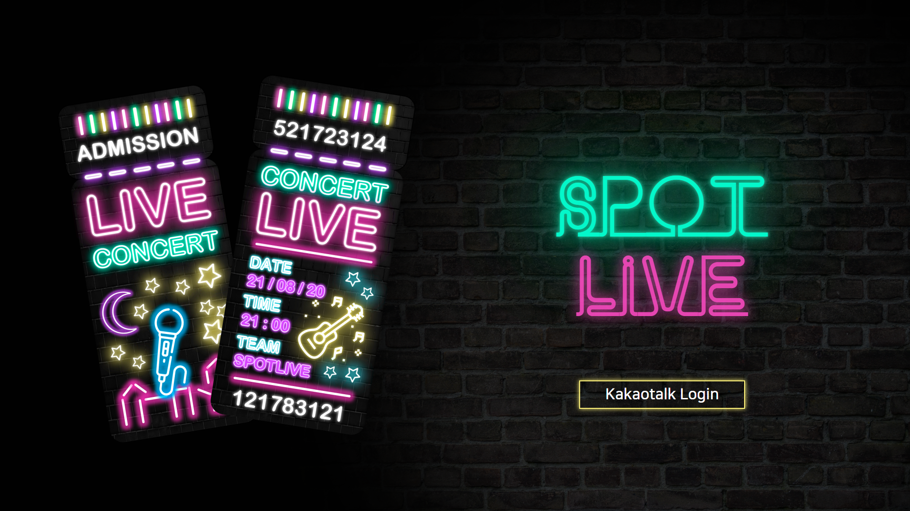

**카카오 로그인** 버튼을 클릭하여 로그인을 할 수 있습니다.

## 1-2. 메인

#### (1) 메인 헤더

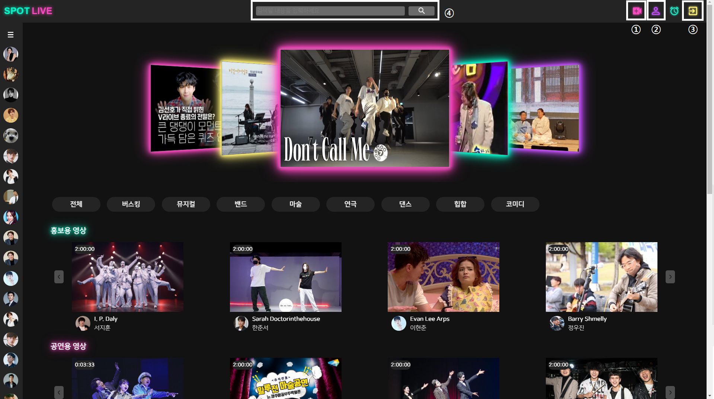

**① 스트리밍 버튼** : 스트리밍을 시작할 수 있습니다.

**② 프로필 버튼** : 자신의 프로필 페이지로 이동할 수 있습니다.

**③ 로그아웃 버튼** : 로그아웃을 할 수 있습니다.

**④ 검색창** : 검색으로 원하는 영상을 찾을 수 있습니다.

- 검색

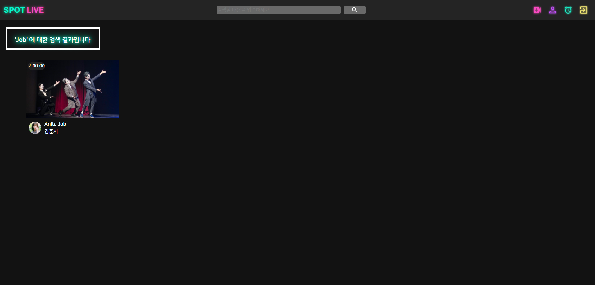

입력한 키워드가 포함된 **유저 이름, 영상 제목, 영상 설명**으로 영상 **검색**을 할 수 있습니다. 

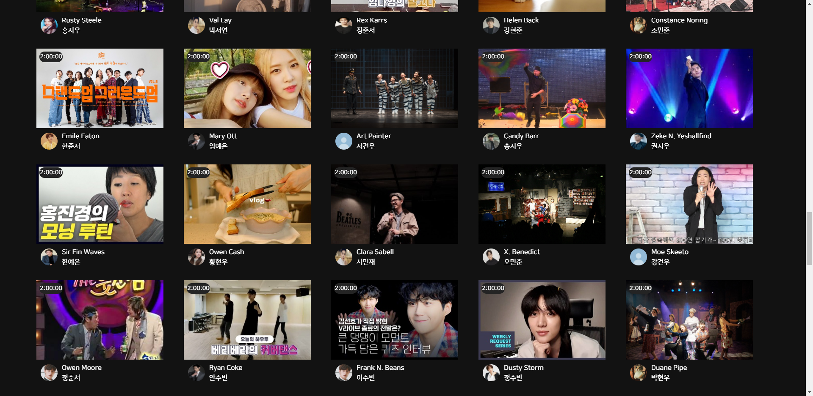

영상은 **Grid 형태**로 구현하며 화면 사이즈에 따라서 **자동으로 한 줄당 나타나는 영상의 개수가 변화**합니다. 더불어 **인피니트 로딩**을 통해 검색 결과가 많은 경우 지속적으로 스크롤을 내리면 더 많은 영상들을 관람할 수 있습니다. 

#### (2) 메인 사이드바

.png)

메인 사이드바에 자신이 **구독한 유저의 리스트**가 보이게 되며, 클릭 시 해당 유저의 **프로필 페이지로 이동**합니다.

상단의 **닫기 버튼**을 누르면 구독한 유저들의 사진만 나타나며 사이드바의 **너비가 줄어듭니다**.

**현재 라이브중인 구독자**는 프로필 사진의 오른쪽 상단에 **핑크색 점**이 나타나 현재 라이브중인지를 시청자가 알 수 있습니다.

#### (3) 상단 3D 캐루젤

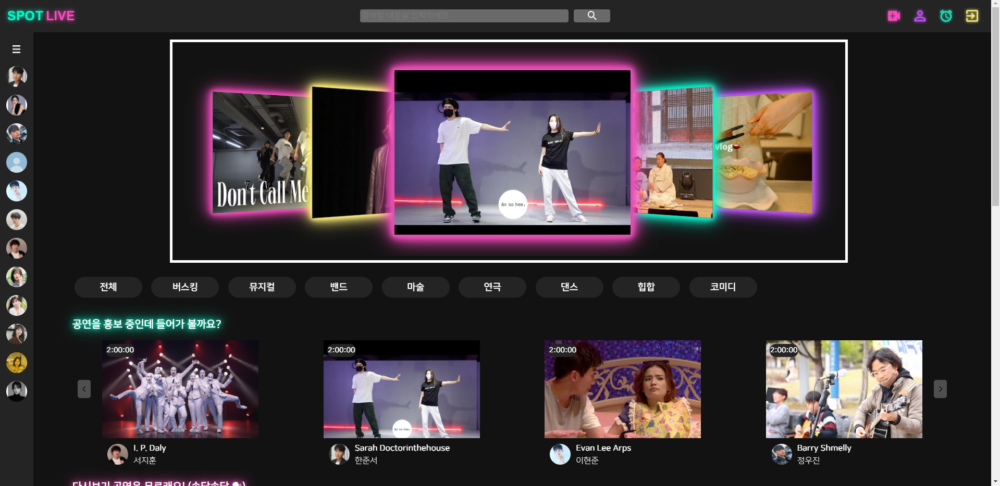

아래에 보여지는 6가지 종류의 영상 (홍보, 공연, 소통, 다시보기, 라이브, 내가 팔로우한 공연자의 영상) 중에서 **현재 라이브인 영상 중 시청자가 가장 많은** 영상, 라이브인 영상이 없다면 다시보기 영상 중 **조회수가 가장 높은 영상**을 **카테고리별로 하나씩** 선정하여 화면에 보여집니다.

**자동으로 회전**하면서 모든 영상을 사용자들이 최대한 많이 접근할 수 있도록 가독성을 높였습니다. SPOT LIVE의 **라이브 간판**의 의미를 살리기 위해 **카테고리별로 대표** 영상을 노출시키며 공연 홍보의 의미를 살렸습니다.

#### (4) 중간 필터 버튼

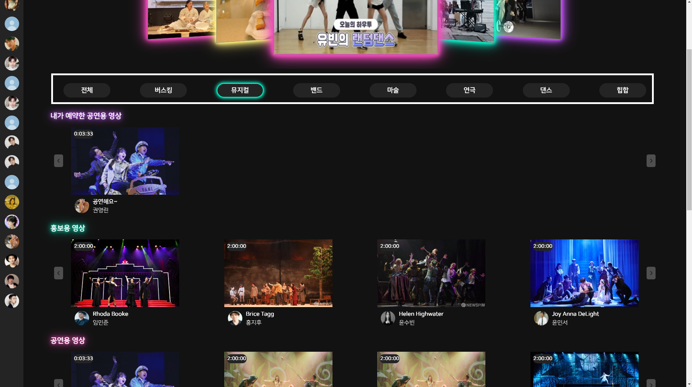

중간에 위치한 **카테고리 필터 버튼**으로 여러 장르의 공연을 관람할 수 있습니다.  **전체 버튼**을 클릭하면 카테고리를 불문하고 전체적인 하단 영상을 조회할 수 있습니다.

**화면이 줄어드는 경우** 필터 버튼들의 개수가 적게 나타나도록 **vue glide**를 사용했으며 **오른쪽으로 스와이핑**하며 카테고리 필터 버튼들을 볼 수 있도록 만들었습니다.

#### (5) 하단 글라이드 

- 각 항목 안내

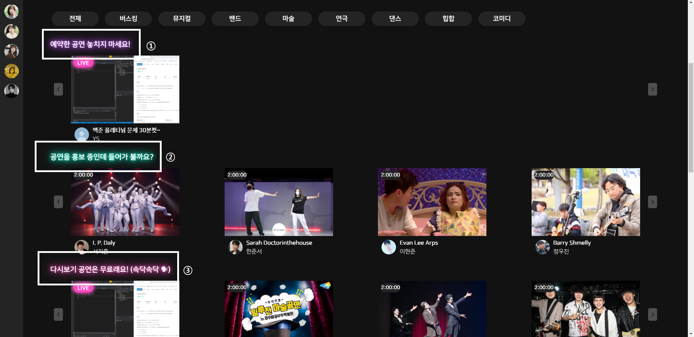

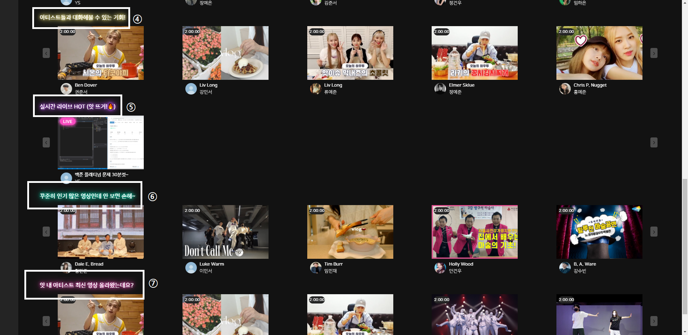

**① 내가 예약한 공연** : 자신이 예약한 **공연이 라이브중**이면 바로 확인할 수 있습니다. 

**② 홍보용 영상** : 공연자가 자신의 공연을 홍보할 수 있는 영상입니다. 시청자는 이 영상을 클릭하여 진입하는 경우 송출자가 홍보한 공연을 바로 예약을 할 수 있습니다.

**③ 공연용 영상** : 공연자가 자신이 등록한 공연을 실시간으로 하는 영상입니다. 시청자는 **라이브 방송의 경우 티켓이 있어야만** 입장할 수 있으며, **다시보기** 영상은 **티켓이 없어도** 입장 가능합니다.

**④ 소통용 영상** : 공연자가 자신의 팬들과 소통하는 목적의 영상입니다.

**⑤ 라이브 영상 중 시청자가 많은 영상** : 현재 **라이브** 영상 중 **시청자**가 많은 순으로 보여집니다.

**⑥ 다시보기 영상 중 조회수가 높은 영상** : **다시보기**로 남은 영상 중 **조회수**가 높은 순으로 보여집니다.

**⑦ 내가 팔로우한 유저의 영상** : 자신이 **팔로우한 유저**가 등록한 최신 영상 리스트를 볼 수 있습니다.

- 하단 글라이드 사용법

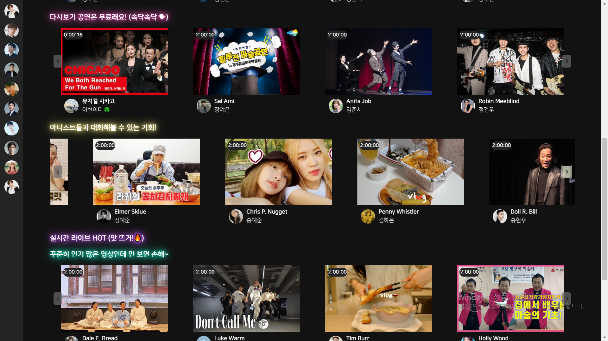

영상목록을 **오른쪽 혹은 왼쪽**으로 **스와이핑**하며 옆으로 넘길 수 있습니다. 이외에도 **양옆에 존재하는 버튼을** 사용하여 슬라이드를 넘길 수 있도록 구현하여 사용자의 편의성을 높였습니다.

#### (5) 공연 예약 

- 라이브중인 공연용 영상의 경우

자신이 예약하지 않은 **라이브 중인 공연용 영상**을 클릭 시 **공연 상세정보 모달이** 뜨게되고, **예약하기**를 누르면 바로 예약할 수 있습니다. 다시보기할 수 있는 공연용 영상과 그 외의 홍보용, 소통용 영상은 모두 **자유롭게** 비디오를 다시 볼 수 있습니다. **실시간 라이브 중인 공연용 영상만** **예매**를 해야 입장할 수 있습니다.

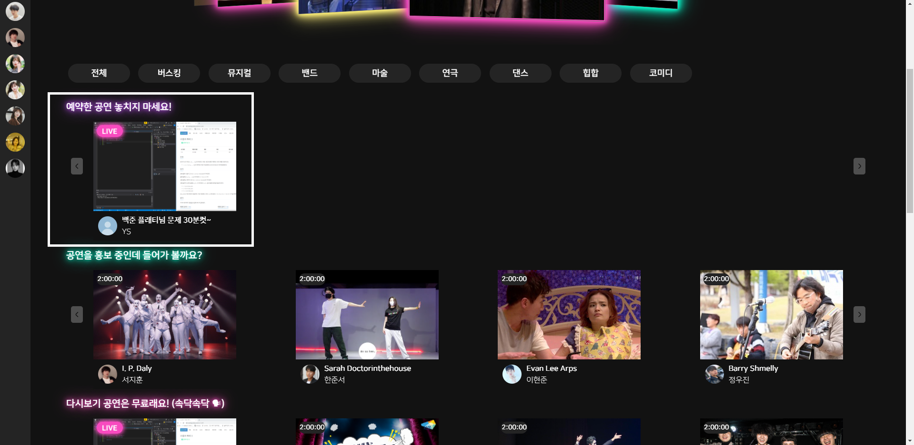

예약을 하면 **즉시** 하단 글라이드에 반영이 되며, **본인이 예약한 공연이 라이브 중일 때 바로 확인**할 수 있습니다. 가장 첫 줄에 이와 같은 영상이 나타나도록 하여 사용자의 편의성을 높였습니다. 

## 1-3. 프로필

#### (1) 공연 정보 생성

.png)

사용자는 **내 프로필** 우측 상단에 있는 **공연 생성 버튼**을 통해 공연 정보를 등록할 수 있습니다.

.png)

공연 생성 모달에 공연 정보를 등록할 때, **유효성 검사를** 통해 1개의 정보라도 등록되지 않으면 **등록버튼이 활성화되지 않습니다.**

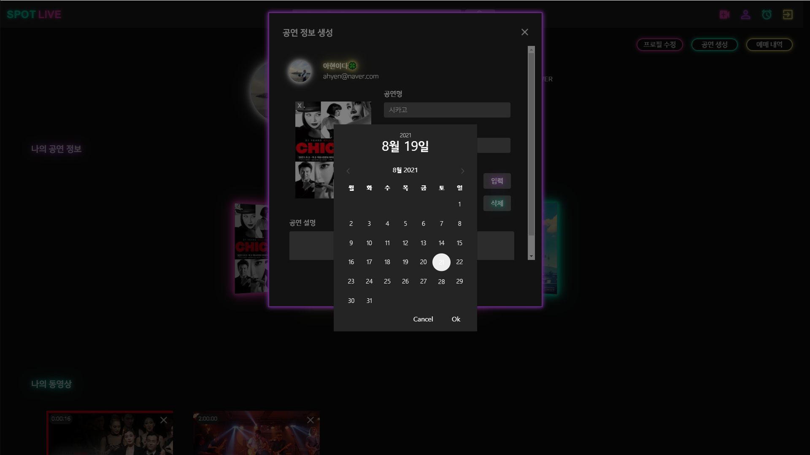

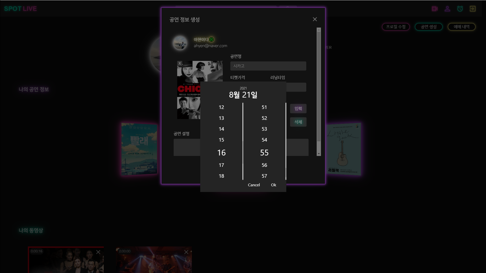

공연 시간은 **Datepicker**를 통해 구현한 달력을 이용해 **날짜와 시간**을 선택할 수 있습니다.

.png)

공연 시간을 등록하고, 입력하면 **토스트 알림**을 통해 **등록이 완료**됐음을 확인할 수 있습니다.

.png)

또한, **같은 시간을 등록**하면 **이미 등록했다는 토스트 알림**이 뜨며 등록이 되지 않습니다.

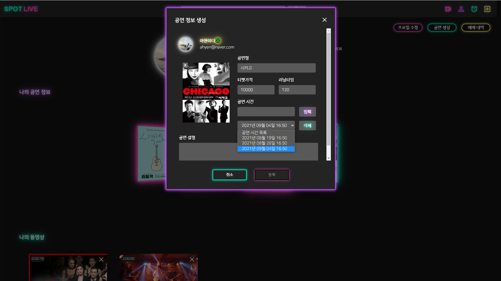

공연 시간 **목록**을 누르면 등록한 **공연 시간들**을 확인하고, **삭제**할 수 있습니다.

.png)

모든 정보를 빠짐없이 입력했으므로, **등록 버튼이 활성화**되어있습니다.

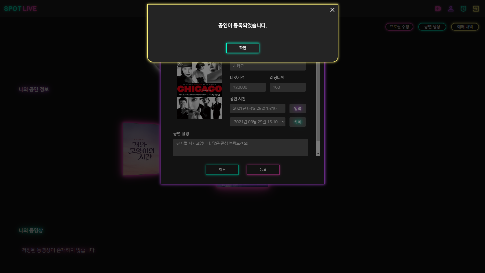

등록 버튼을 누르면, 공연이 **등록**되었다는 **알림을 확인**할 수 있습니다.

.png)

등록된 공연은 **프로필 중앙 캐루젤**에서 확인할 수 있습니다. 중앙의 캐루젤은 **최대 5개**가 보여지며**, 자동으로 회전하면서** 모든 공연의 정보를 사용자들이 최대한 많이 접근할 수 있도록 가독성을 높였습니다. SPOT LIVE의 **라이브 간판**의 의미를 살리기 위해 **메인페이지의 상단 캐루젤**처럼 영상뿐만 아니라 **공연 정보 포스터를 캐루젤**로 구현하여 **공연 홍보의 의미**를 살렸습니다. 

#### (2) 공연 정보 상세 조회

프로필의 중앙 캐루젤에서 공연 **포스터를 클릭**하면, 등록한 공연의 **상세 정보 모달을 확인**할 수 있습니다. 상세 정보 모달의 하단에 있는 **삭제와 수정 버튼을 통해 자신의 공연 정보를 관리**할 수 있습니다.

#### (3) 공연 정보 수정

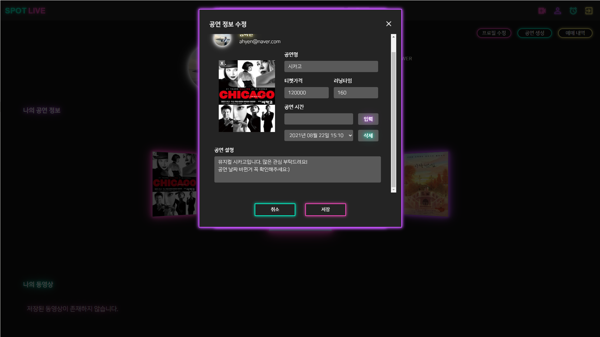

공연 정보를 수정하는 모달입니다. 공연 정보를 등록할 때 입력한 정보들을 **수정**할 수 있습니다.

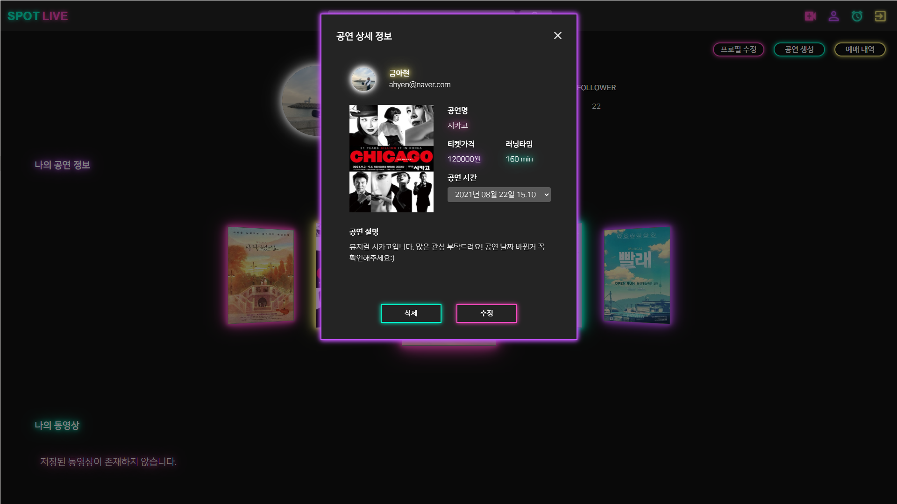

수정 정보를 **저장한 후**에는 변경된 수정 모달이 닫힌 후 **바로 변경된 사항**을 **공연 정보 상세 모달**에서 확인할 수 있습니다.

#### (4) 공연 정보 삭제

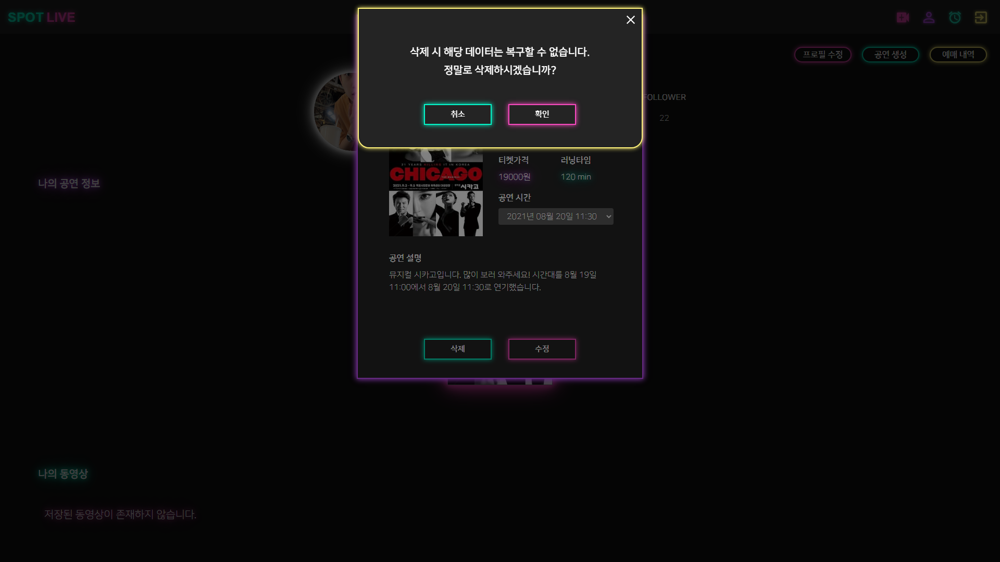

공연 상세 정보 모달에서 **삭제 버튼을 누르면**, 예약을 삭제할지 한번 더 묻고, **확인 버튼을 누르면** 해당 공연 정보를 **삭제**할 수 있습니다. **취소 버튼을 클릭하면** 다시 현재의 **공연 정보 상세 모달**로 돌아갑니다.

- 프로필 수정 기능

.png)

내 프로필의 우측 상단에 **프로필 수정 버튼**을 누르면 프로필을 수정할 수 있습니다.

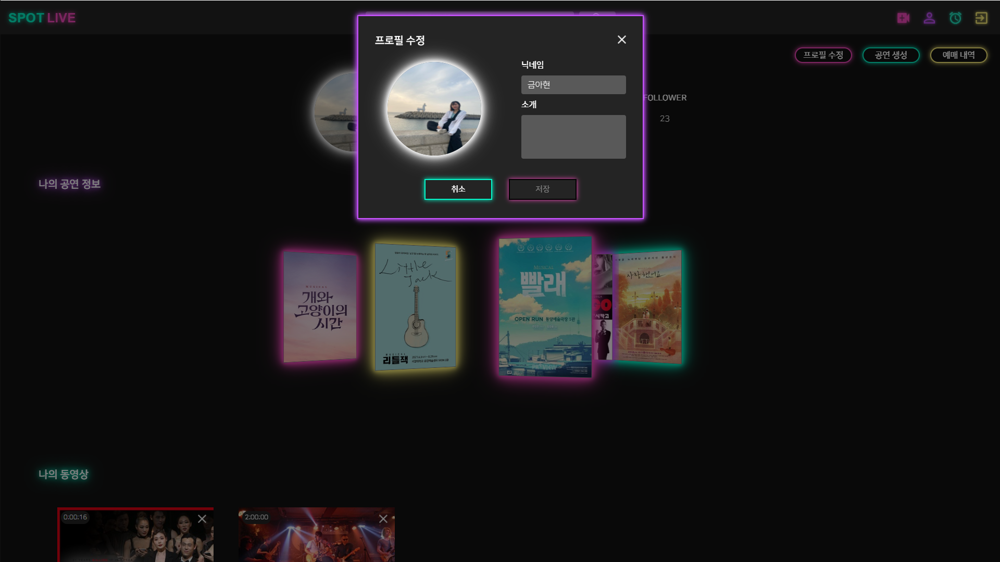

수정 모달을 통해, **닉네임과 소개**를 수정할 수 있습니다. **빈 칸일 경우 저장할 수 없도록 유효성 검사**를 실시하고 있으며 유효성 검사를 통과한 경우 **저장 버튼**을 클릭하면 **프로필에 실시간으로 반영**됩니다.

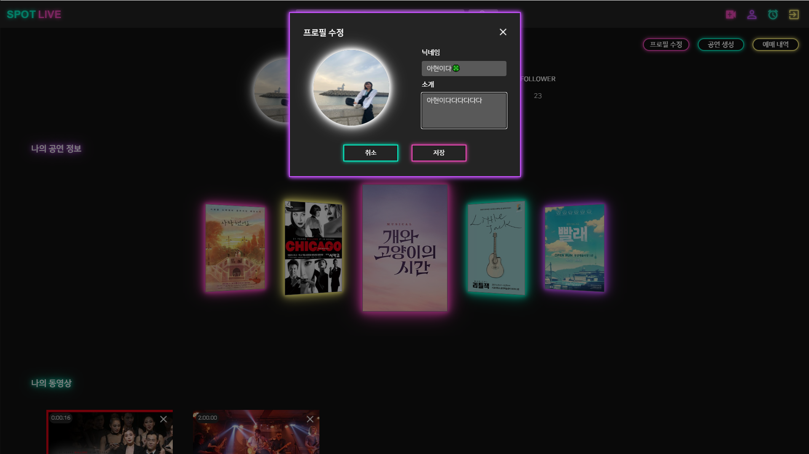

수정할 정보를 입력 후, **저장 버튼**을 누르면 **수정이 완료**됩니다.

.png)

수정한 정보들이 **내 프로필에 반영**된 것을 확인할 수 있습니다.

- 내 동영상 보기 / 삭제

.png)

프로필 하단에서 **나의 동영상**을 확인할 수 있습니다.

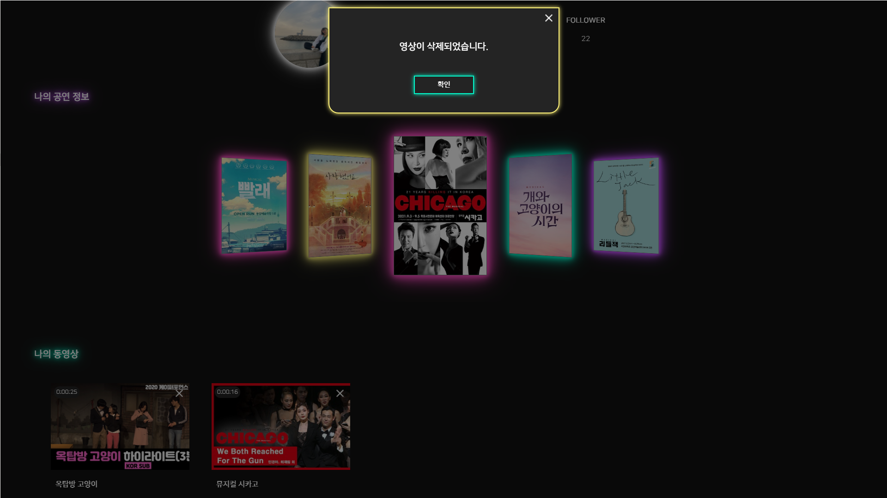

동영상의 우측 상단에 있는 **X버튼**을 클릭하면, **영상을 삭제**할 수 있습니다.

## 1-4. 영상 송출

#### (1) 영상 정보 설정

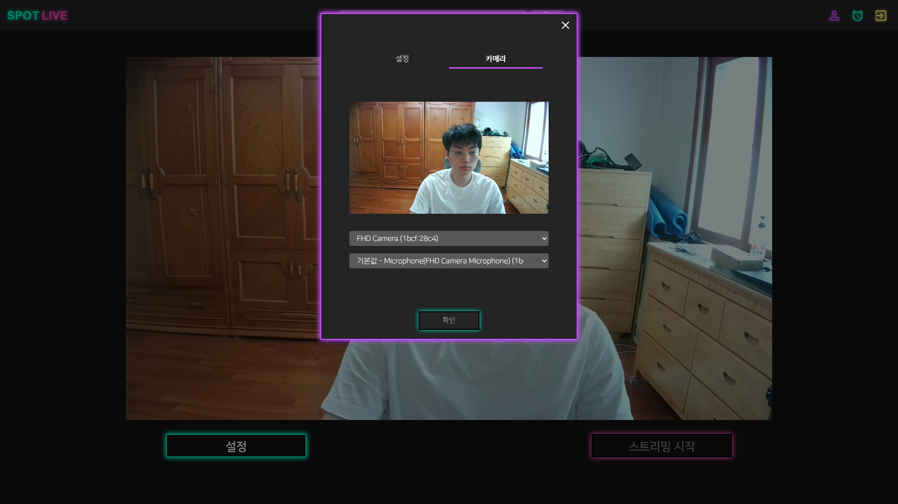

시스템에 연결된 **카메라**와 **마이크** 출력부분을 선택할 수 있습니다.

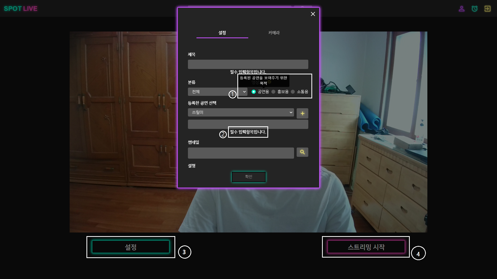

영상 송출에 필요한 정보를 입력하기 위한 모달입니다.

1. 영상의 용도를 선택하기 위한 선택옵션에 대한 안내문구를 마우스 **hover**를 통해 볼 수 있습니다.
2. **유효성 검사**를 구현하여 필수 입력 항목, 숫자만 입력가능 항목 등을 안내받을 수 있습니다.
3. 송출할 **영상 정보**를 입력하기 위한 설정 버튼입니다.
4. 설정이 완료되면 **활성화되는 스트리밍 시작 버튼**입니다.

#### (2) 스트리밍 시작

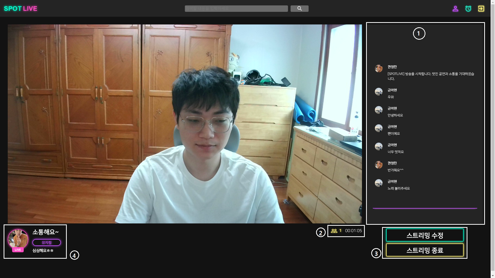

영상을 실시간으로 스트리밍하며 시청자와 소통할 수 있는 스트리밍 페이지입니다.

1. 시청자와 **실시간 채팅 기능**을 통해 소통할 수 있습니다.
2. 시청자의 수와 **영상 재생시간**이 실시간으로 업데이트됩니다
3. 스트리밍 정보에 대한 **수정과 종료**에 대한 버튼입니다.
4. **송출자와 영상에 대한 정보(카테고리, 제목, 설명, 프로필 사진)**가 보여집니다. 

#### (3) 영상 정보 수정

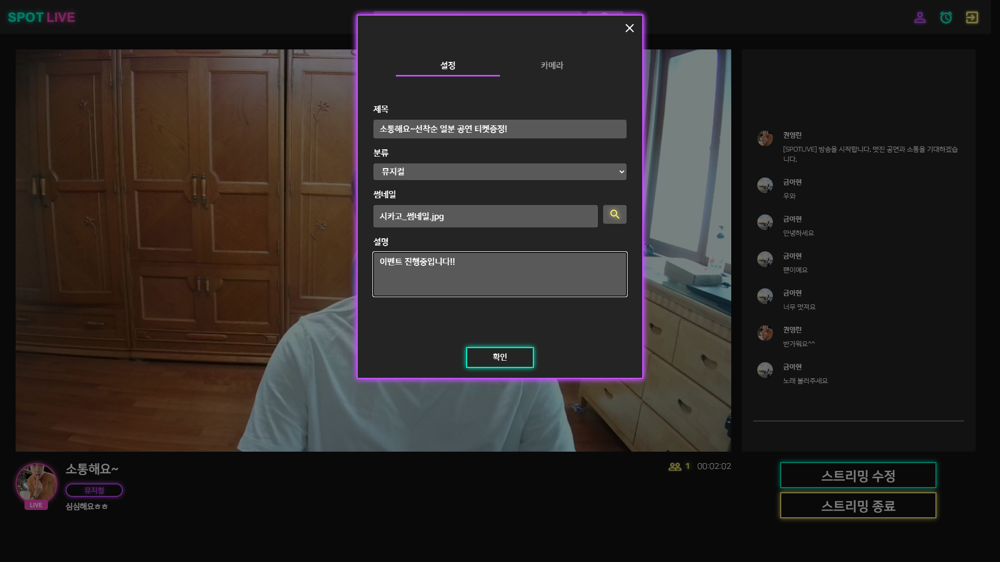

영상정보 **수정**을 할 수있는 폼입니다. 수정 후 **확인 버튼**을 클릭하면 실시간으로 수정된 영상 정보가 **화면에 반영**됩니다.

#### (4) 스트리밍 종료

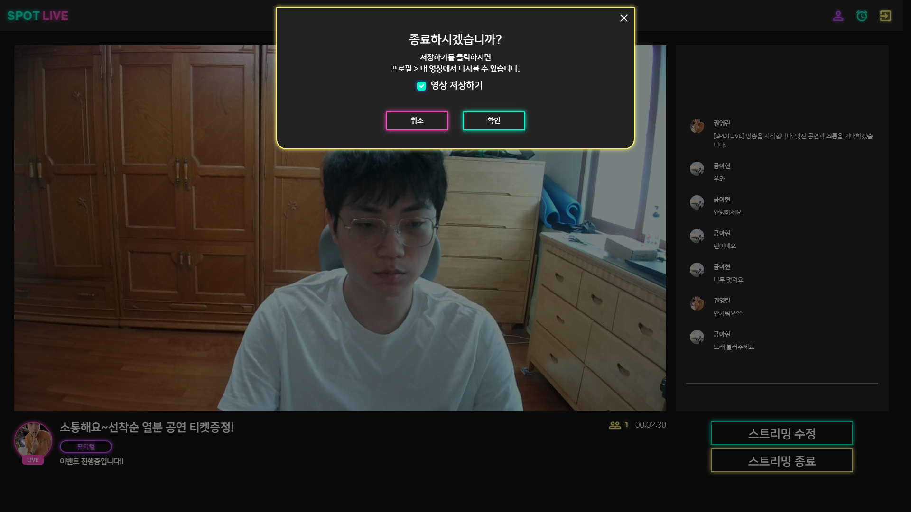

스트리밍을 마칠 때 **종료버튼**을 통해 **저장여부 체크**와 함께 종료 여부를 **선택**할 수 있습니다.

저장을 선택한다면 프로필 > 내 동영상에 영상이 추가되며 시청자는 다시보기로 볼 수 있습니다. 

저장을 선택하지 않는다면 일회성 영상으로 서버에 기록되지 않고 종료됩니다. 

## 시청자

## 2-1 로그인

- 로그인 페이지

**카카오 로그인** 버튼을 클릭하여 로그인을 할 수 있습니다.

## 2-2. 메인

#### (1) 메인 헤더

**① 스트리밍 버튼** : 스트리밍을 시작할 수 있습니다.

**② 프로필 버튼** : 자신의 프로필 페이지로 이동할 수 있습니다.

**③ 로그아웃 버튼** : 로그아웃을 할 수 있습니다.

**④ 검색창** : 검색으로 원하는 영상을 찾을 수 있습니다.

#### (2) 메인 사이드바

-16309765741445.png)

메인 사이드바에 자신이 **구독한 유저의 리스트**가 보이게 되며, 클릭 시 해당 유저의 **프로필 페이지로 이동**합니다.

상단의 **닫기 버튼**을 누르면 구독한 유저들의 사진만 나타나며 사이드바의 **너비가 줄어듭니다**.

**현재 라이브중인 구독자**는 프로필 사진의 오른쪽 상단에 **핑크색 점**이 나타나 현재 라이브중인지를 시청자가 알 수 있습니다.

#### (3) 검색

입력한 키워드가 포함된 **유저 이름, 영상 제목, 영상 설명**으로 영상 **검색**을 할 수 있습니다. 

영상은 **Grid 형태**로 구현하며 화면 사이즈에 따라서 **자동으로 한 줄당 나타나는 영상의 개수가 변화**합니다. 더불어 **인피니트 로딩**을 통해 검색 결과가 많은 경우 지속적으로 스크롤을 내리면 더 많은 영상들을 관람할 수 있습니다. 

#### (4) 상단 3D 캐루젤

아래에 보여지는 6가지 종류의 영상 (홍보, 공연, 소통, 다시보기, 라이브, 내가 팔로우한 공연자의 영상) 중에서 **현재 라이브인 영상 중 시청자가 가장 많은** 영상, 라이브인 영상이 없다면 다시보기 영상 중 **조회수가 가장 높은 영상**을 **카테고리별로 하나씩** 선정하여 화면에 보여집니다.

**자동으로 회전**하면서 모든 영상을 사용자들이 최대한 많이 접근할 수 있도록 가독성을 높였습니다. SPOT LIVE의 **라이브 간판**의 의미를 살리기 위해 **카테고리별로 대표** 영상을 노출시키며 공연 홍보의 의미를 살렸습니다.

#### (5) 중간 필터 버튼

중간에 위치한 **카테고리 필터 버튼**으로 여러 장르의 공연을 관람할 수 있습니다.  **전체 버튼**을 클릭하면 카테고리를 불문하고 전체적인 하단 영상을 조회할 수 있습니다.

**화면이 줄어드는 경우** 필터 버튼들의 개수가 적게 나타나도록 **vue glide**를 사용했으며 **오른쪽으로 스와이핑**하며 카테고리 필터 버튼들을 볼 수 있도록 만들었습니다.

#### (6) 하단 글라이드 

- 각 항목 안내

**① 내가 예약한 공연** : 자신이 예약한 **공연이 라이브중**이면 바로 확인할 수 있습니다. 

**② 홍보용 영상** : 공연자가 자신의 공연을 홍보할 수 있는 영상입니다. 시청자는 이 영상을 클릭하여 진입하는 경우 송출자가 홍보한 공연을 바로 예약을 할 수 있습니다.

**③ 공연용 영상** : 공연자가 자신이 등록한 공연을 실시간으로 하는 영상입니다. 시청자는 **라이브 방송의 경우 티켓이 있어야만** 입장할 수 있으며, **다시보기** 영상은 **티켓이 없어도** 입장 가능합니다.

**④ 소통용 영상** : 공연자가 자신의 팬들과 소통하는 목적의 영상입니다.

**⑤ 라이브 영상 중 시청자가 많은 영상** : 현재 **라이브** 영상 중 **시청자**가 많은 순으로 보여집니다.

**⑥ 다시보기 영상 중 조회수가 높은 영상** : **다시보기**로 남은 영상 중 **조회수**가 높은 순으로 보여집니다.

**⑦ 내가 팔로우한 유저의 영상** : 자신이 **팔로우한 유저**가 등록한 최신 영상 리스트를 볼 수 있습니다.

- 하단 글라이드 사용법

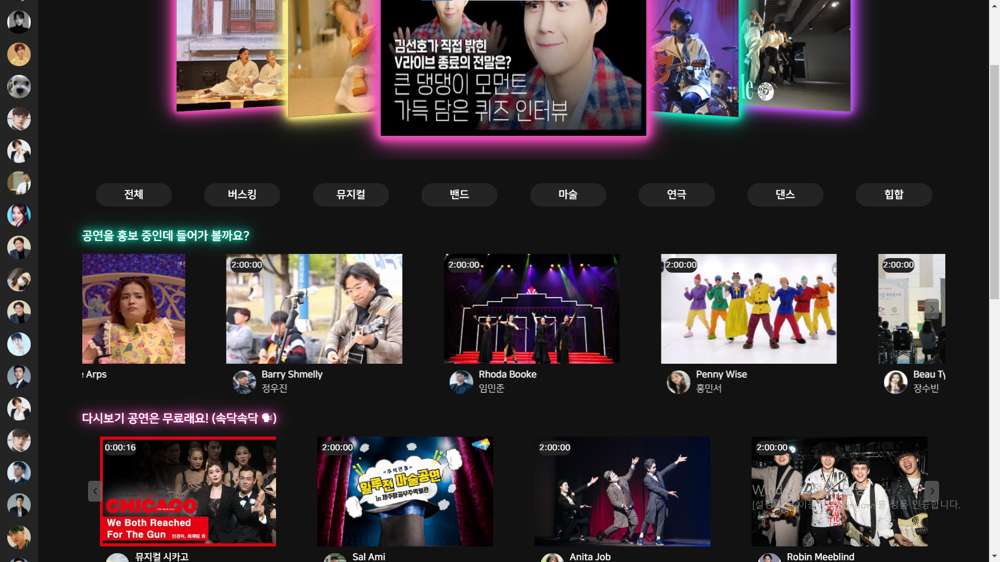

영상목록을 **오른쪽 혹은 왼쪽**으로 **스와이핑**하며 옆으로 넘길 수 있습니다. 이외에도 **양옆에 존재하는 버튼을** 사용하여 슬라이드를 넘길 수 있도록 구현하여 사용자의 편의성을 높였습니다.

#### (7) 공연 예약 

- 라이브중인 공연용 영상의 경우

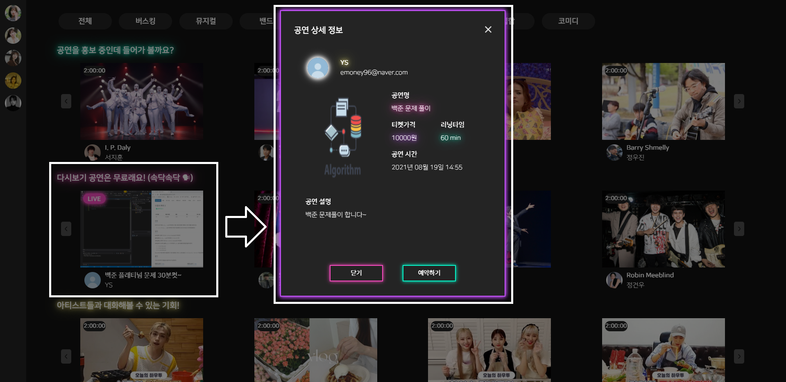

자신이 예약하지 않은 **라이브 중인 공연용 영상**을 클릭 시 **공연 상세정보 모달이** 뜨게되고, **예약하기**를 누르면 바로 예약할 수 있습니다. 다시보기할 수 있는 공연용 영상과 그 외의 홍보용, 소통용 영상은 모두 **자유롭게** 비디오를 다시 볼 수 있습니다. **실시간 라이브 중인 공연용 영상만** **예매**를 해야 입장할 수 있습니다.

예약을 하면 **즉시** 하단 글라이드에 반영이 되며, **본인이 예약한 공연이 라이브 중일 때 바로 확인**할 수 있습니다. 가장 첫 줄에 이와 같은 영상이 나타나도록 하여 사용자의 편의성을 높였습니다. 

## 2-3 프로필

#### (1) 예약

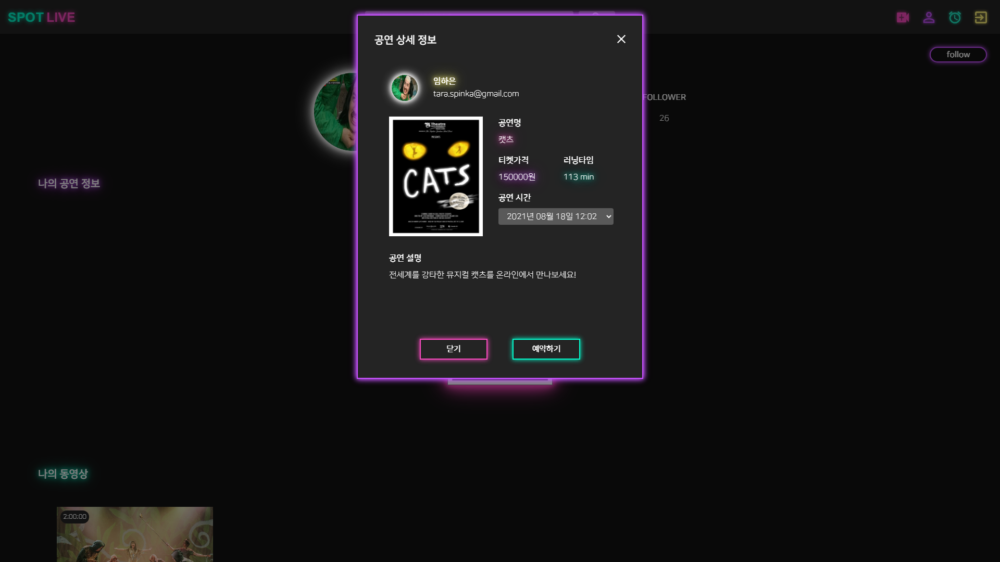

다른 사람의 **프로필**에 있는 **중앙 캐루젤의 포스터**들을 클릭하여 공연 **상세 정보를을 확인**하고, 원하는 시간을 **예약**할 수 있습니다.

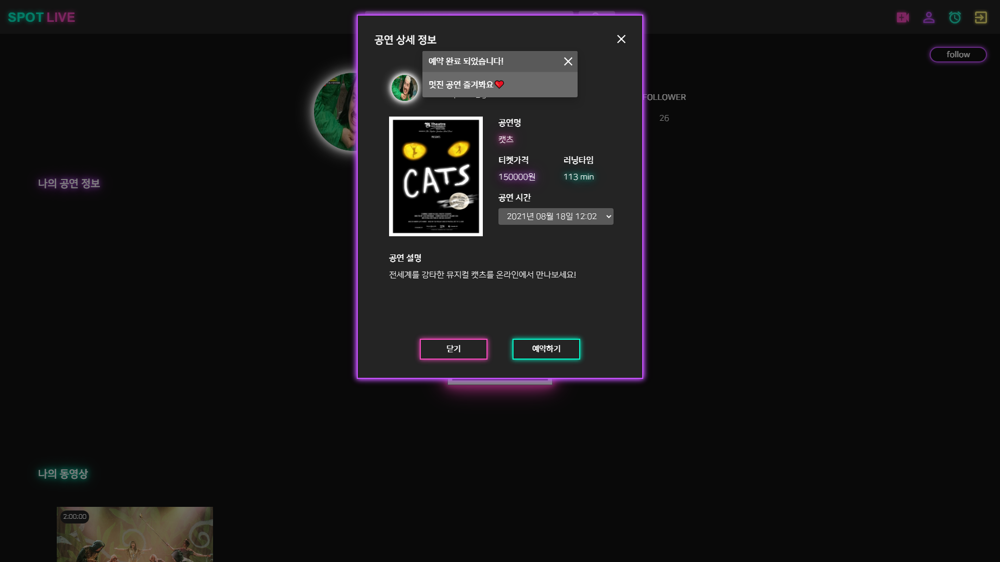

예약이 완료되면, **토스트 메시지**를 통해 **예약 완료를 확인**할 수 있습니다.

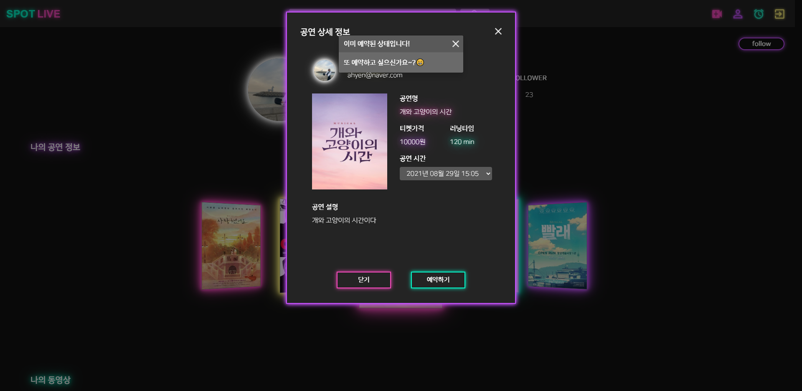

**예약을 이미 한 경우** **다시** 예약하기 버튼을 클릭하면 **토스트 메시지**를 통해 **예약 완료를 확인**할 수 있습니다.

#### (2) 예약 전체 내역 조회

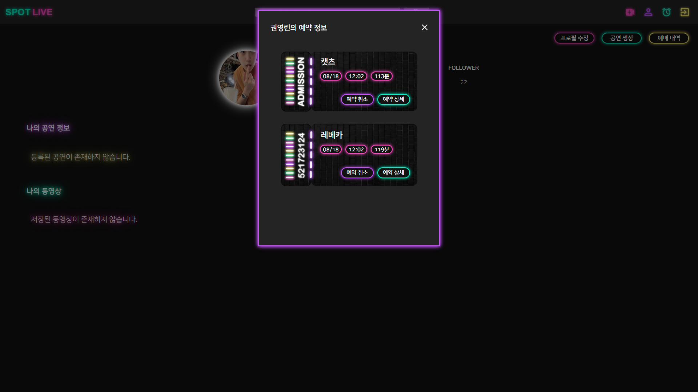

**내 프로필**로 이동하면, **예약한 공연의 티켓**들을 확인할 수 있습니다. 티켓의 하단에 있는 **예약 취소 버튼**을 누르면 해당 공연의 예약을 취소할 수 있고, **예약 상세 버튼**을 누르면 해당 **공연의 상세 정보**를 확인할 수 있습니다. 

#### (3) 예약 상세 내역 조회

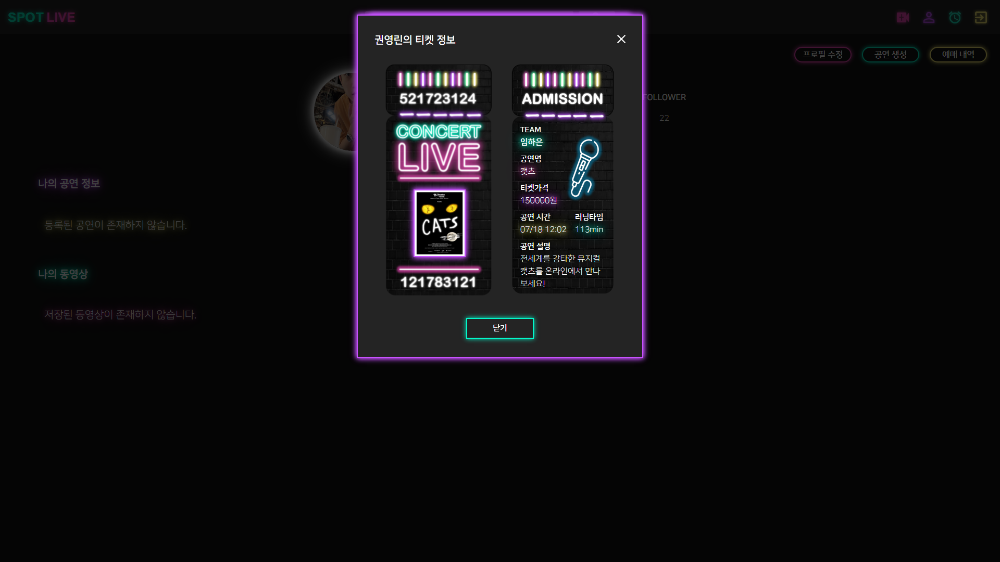

**예약 상세 정보**를 확인할 수 있는 모달입니다. 예약한 공연의 포스터, 공연자, 공연 제목, 티켓가격, 공연 시간, 러닝타임, 공연 설명을 확인할 수 있습니다.

**당신만을 위한 티켓**이라는 시청자를 위한 특별함을 강조하기 위해 **직접 제작한 티켓 디자인** 위에 **예약 상세 정보**를 담았습니다.

#### (4) 예약 취소

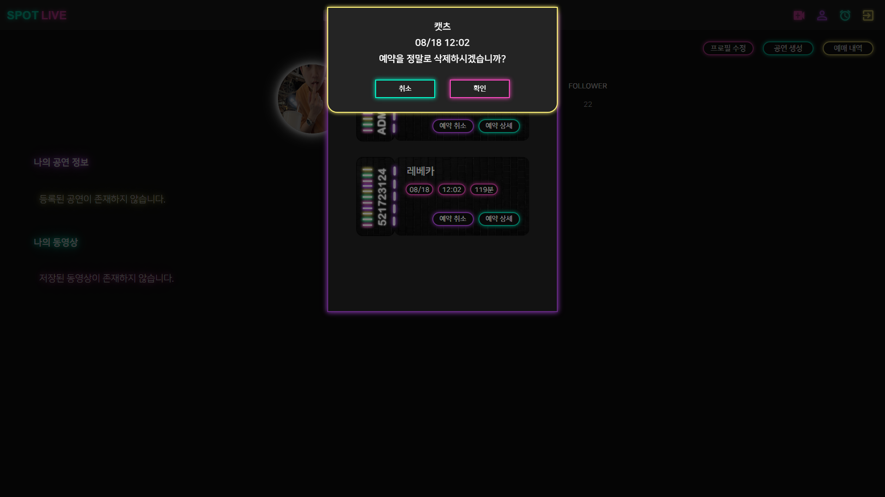

예약을 **취소**할 수 있는 모달입니다. 예약을 **삭제할지** 한 번 더 묻고, **확인 버튼을** 누르면 해당 예약을 **삭제**할 수 있습니다. **취소 버튼**을 클릭하면 예약 내역 모달로 돌아갑니다.

#### (5) 팔로우 기능

.png)

다른 사람의 **프로필**에 가면 우측 상단에 **follow 버튼**을 확인할 수 있습니다. 이 버튼을 클릭하면 해당 유저를 **팔로우**할 수 있습니다. 내가 팔로우한 유저들은 메인 화면의 **메인 사이드바**에서 확인할 수 있습니다.

.png)

**이미 팔로우한** 사람의 프로필에는 우측 상단에 **unfollow 버튼**이 존재합니다. 이 버튼을 클릭하면 해당 유저의 **팔로우를 취소**할 수 있습니다.

#### (6) 프로필 수정 기능

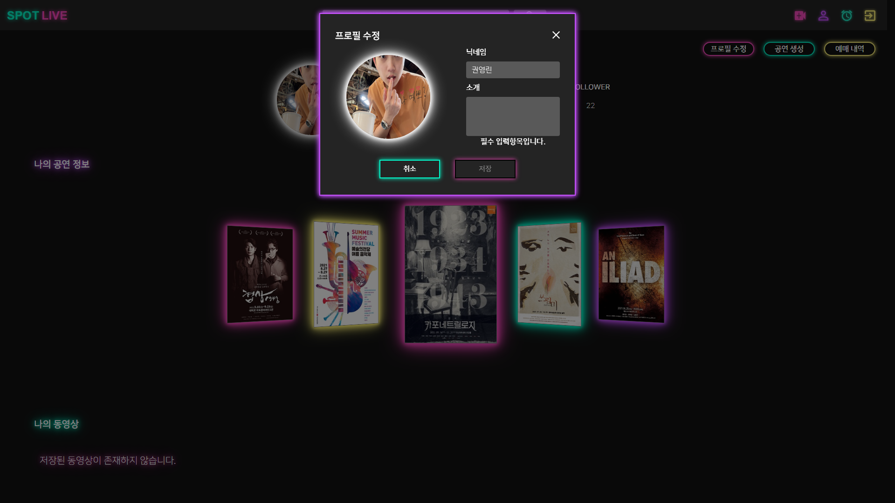

내 프로필의 우측 상단에 **프로필 수정 버튼**을 누르면 프로필을 수정할 수 있습니다.

수정 모달을 통해, **닉네임과 소개**를 수정할 수 있습니다. **빈 칸일 경우 저장할 수 없도록 유효성 검사**를 실시하고 있으며 유효성 검사를 통과한 경우 **저장 버튼**을 클릭하면 **프로필에 실시간으로 반영**됩니다.

## 2-4 영상 시청

#### (1) 영상 시청 

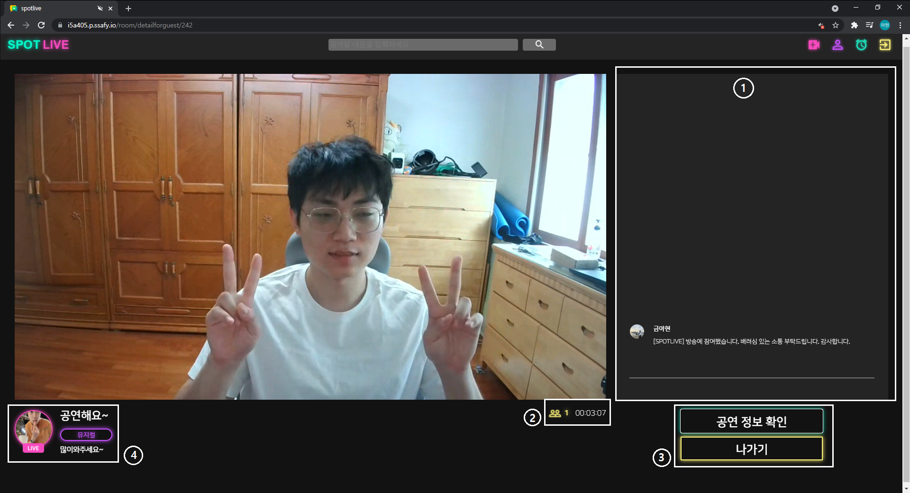

예약한 공연의 영상 시청페이지입니다.

1. 공연자와 **실시간으로 채팅**하며 소통할 수 있습니다.
2. 시청중인 공연의 **시청자수와 송출시간 정보**를 실시간으로 확인할 수 있습니다.
3. **공연 정보를 확인**하거나 시청중인 공간을 **나갈 수 있는 버튼**입니다.
4. **송출자와 영상 정보(카테고리, 제목, 설명, 프로필 사진)**를 확인할 수 있습니다. 프로필 **사진의 경우 클릭**하면 해당 유저의 프로필로 **이동**할 수 있습니다.

#### (2) 공연 정보 상세 조회 모달 

- 공연용 영상

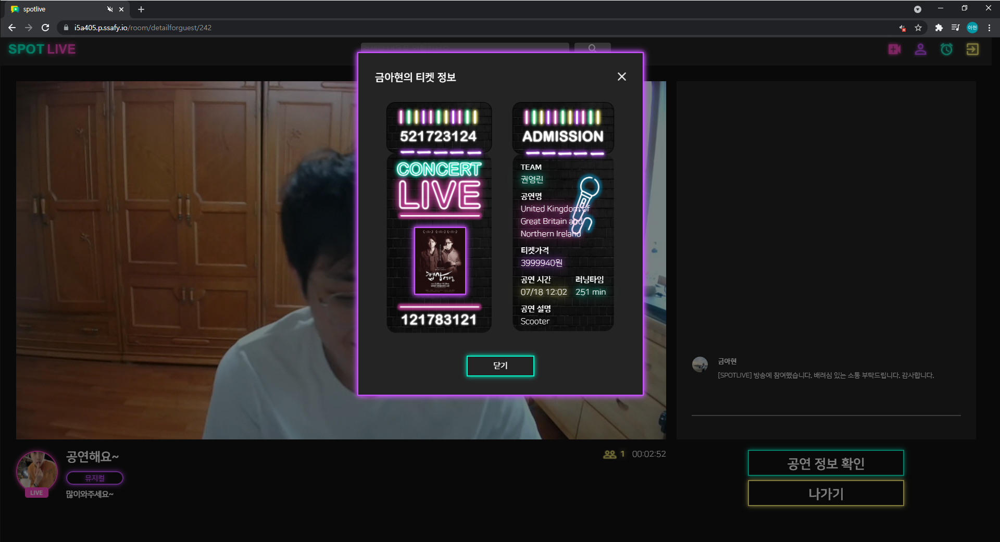

공연 시청중에 **공연 정보 확인 버튼**을 통해 해당 공연의 정보를 **티켓**을 통해 확인할 수 있습니다. 

#### (3) 예약 모달 

- 홍보용 영상

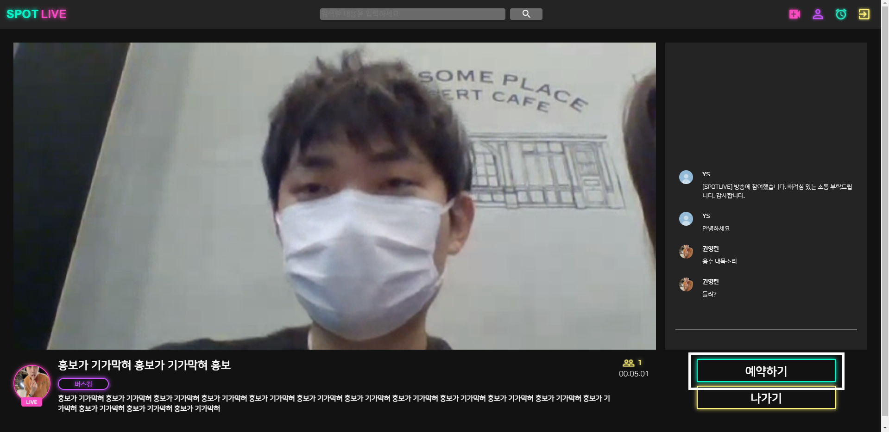

우측 하단에 **예약하기 버튼**을 눌러서 공연 예약을 할 수 있습니다.

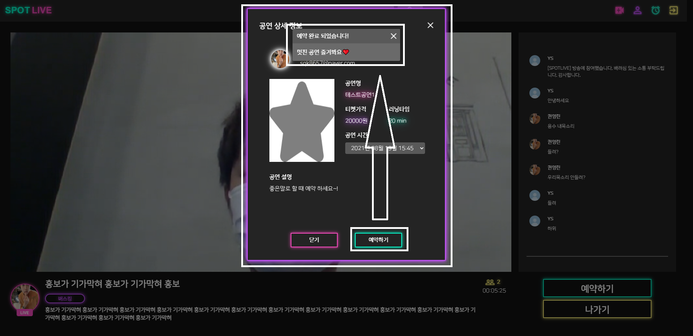

공연 상세 정보에서 예약하기 버튼 클릭 시 **예약 완료 토스트**가 뜨게되며 예약이 완료됩니다. **타인의 프로필**에서 예약을 했을 때와 마찬가지로 **예약을 이미 한 경우** **예약이 이미 완료**되었다는 알림의 토스트가 나타납니다.

#### (4) 영상 시청 종료

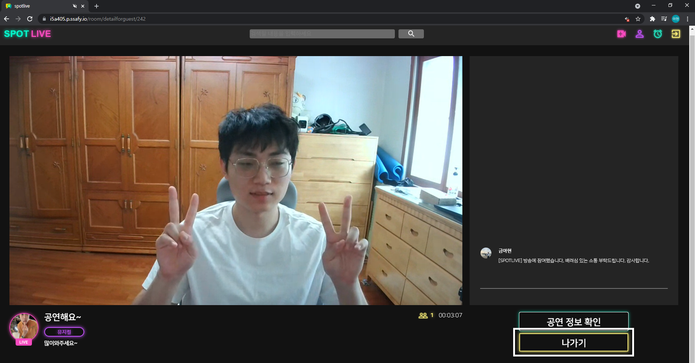

우측 하단에 있는 **나가기 버튼**을 누르면 영상시청을 **종료**할 수 있습니다.

---

